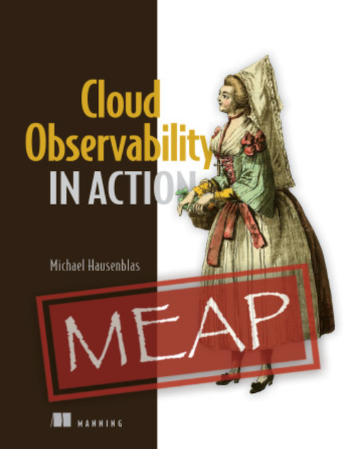

## Cloud Observability in Action

Welcome to Cloud Observability in Action, your hands-on guide to applying
observability in the context of cloud native environments.

> Observability is the capability to continuously generate and discover 
> actionable insights based on signals from the system under observation 
> with the goal to influence the system.

In this book you will learn about the basic signal types (logs, metrics, traces,
profiles), telemetry including agents, back-end and front-end destinations, 
and goood practices around dashboarding, alerting, and SLOs/SLIs.

Some chapters of the book are now available via the [Manning MEAP Program](https://www.manning.com/books/cloud-observability-in-action)
and you can find [code snippets](https://github.com/mhausenblas/o11y-in-action.cloud/tree/main/code) we use throughout the book via the 
site you're on, currently.

The WIP table of contents looks as follows:

## Chapter 1: End-to-end Observability Example
In the context of this book we focus on cloud native environments such as 
Kubernetes and serverless offerings (such as FaaS like AWS Lambda). We mainly
use open source observability tooling (Grafana, Prometheus, Jaeger) so that 
you can try out everything without license costs. While it is important that
we use open source tooling to show the concepts in action, they are universally
applicable (that is, using any of the commerical offerings). 
In this chapter we have a look at an end-to-end example and define terminology,
from sources to agents to destinations.

* Introducing observability
* Example microservices app in action
* Challenges and how observability helps

## Chapter 2: Signal Types
In this chapter we review different signal types most often used, 
how to instrument and collect each, and discuss the costs and benefits of doing 
that. With observability you want to take an Return-On-Investment (ROI) driven
approach. In other words, you need to understand the costs of each signal type 
and what it enables you to do.

* Reference example
* Assessing costs
* Logs
* Metrics
* Traces
* Selecting signals

## Chapter 3: Sources
This chapter covers signal sources. We discuss the type of sources that exist
and when to select which source, how you can gain actionable insights from selecting
the right sources for a task and how to deal with code you own including supply chain aspects.

* Selecting sources
* Compute-related sources
* Storage-related sources
* Network-related sources
* Your code (instrumentation)

## Chapter 4: Agents
ETA: 07/2022

## Chapter 5: Back-end Destinations
TBD.

## Chapter 6: Front-end Destinations
TBD.

## Chapter 7: Alerting
TBD.

## Chapter 8: Distributed Tracing
TBD.

## Chapter 9: Continuous Profiling
TBD.

## Chapter 10: Service Level Objectives
TBD.
