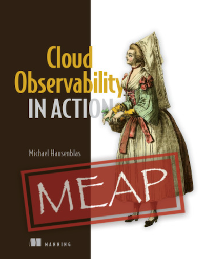

---
hide:
  - navigation
---

# Cloud Native Observability in Action

Welcome to the Cloud Native Observability in Action book! This is your
Return on Investment driven hands-on guide to introducing observability in your
organization. The book is currently available online via the
[Manning MEAP Program](https://www.manning.com/books/cloud-observability-in-action)
and also the [code snippets](https://github.com/mhausenblas/o11y-in-action.cloud/tree/main/code) 
we use for the hands-on exercises throughout the book are available.

We expect that the book goes into print in May 2023.

[Chapter 1: End-to-end Observability Example](ch1)

[Chapter 2: Signal Types](ch2)

[Chapter 3: Sources](ch3)

[Chapter 4: Agents](ch4)

[Chapter 5: Back-end Destinations](ch5)

[Chapter 6: Front-end Destinations](ch6)

[Chapter 7: Cloud Operations](ch7)

[Chapter 8: Distributed Tracing](ch8)

[Chapter 9: Developer Observability](ch9)

[Chapter 10: Service Level Objectives](ch10)

[Chapter 11: Signal Correlation](ch11)

[Appendix A](ch1)

More details about [all chapter content](ch1) ...

## What is observability?

> Observability is the capability to continuously generate and discover 
> actionable insights based on signals from the system under observation 
> with the goal to influence the system.

## What does Return on Invesment mean in this context?

> Working backwards from technical and business goals (be that MTTR reduction,
> cost savings, or increasing developer productivity) to establish crisp returns.

Read more about the concept in the short paper [Return on Investment Driven Observability](https://arxiv.org/abs/2303.13402).

## What does this book offer?

In this book you will learn about the basic signal types (logs, metrics, traces,
profiles), telemetry including instrumentation and agents, back-end destinations, 
front-ends and all-in-ones, goood practices around dashboarding, alerting, SLOs/SLIs,
developer observability, and signal correlation.

It helps you understanding observability concept using open source
tooling and applying observability in the context of cloud native environments.

